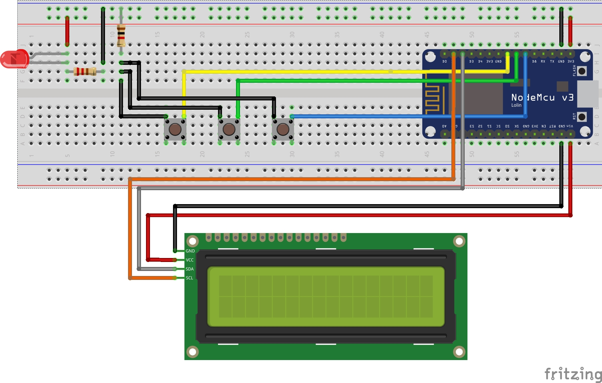

# Praktikum Wirtschaftsinformatik

Dieses Repository enthält einen Prototypen, der im Rahmen des Praktiums Wirtschaftsinformatik an der Universität Oldenburg enstanden ist.

Der Protoyp soll eine Erfassung von Arbeitszeiten mittels einer minimalistischen Hardware-Lösung demonstrieren und erhebt keinerlei Anspruch auf Vollständigkeit und Fehlerfreiheit.

## Video

## Bauteile

- NodeMCU V1/V3
- 3 Taster
- 1 LED
- 1 220Ω Widerstand
- 1 1kΩ Widerstand
- 1602 LCD Display mit I²C Konverter
- Dupont-Kabel / Steckverbinder

## Platine

## Quellcode

Der Quellcode befindet sich in der Datei [SketchProto](./SketchProto.ino).
Um diese auszuführen muss noch die `LiquidCrystal_I2C` Bibliothek über das Arduino Studio installiert werden.